# Concord

Concord is a multilingual business entity-resolution project. It began as Team Aurorawave's solution to the Amazon ML Challenge 2026 Business Entity Resolution task and is being preserved as a reproducible engineering project.

The repository's first baseline is historical. It records the exact source behavior, feature order, model configuration, decision policy, results, artifact identities, and experiment history associated with the submitted system. It does not include organizer datasets, generated candidate graphs, final TSV outputs, or the trained model.

## Verified Amazon baseline

| Item | Verified value |
|---|---:|
| Public leaderboard Macro F0.5 | 0.955136 |
| POLICY_DEV Macro F0.5 | 0.9593640004712406 |
| Test Source-1 rows | 1,732,544 |
| Valid Source-2/Source-3 target IDs | 9,969,589 |
| Frozen candidate pairs | 87,934,151 |
| Accepted links | 5,708,382 |
| Empty Source-1 output rows | 100,939 |
| Training candidate rows | 3,376,945 |
| Model inputs | 59 float32 features |

The leaderboard value is supported by preserved portal evidence and user-confirmed submission chronology. The remaining counts and development metric are supported by local manifests, reports, output hashes, and validator evidence. See [Results](docs/RESULTS.md) and [Provenance](docs/PROVENANCE.md).

## Historical architecture

```mermaid
flowchart LR
    A[Organizer S1, S2, S3 TSVs] --> B[Country-partitioned normalization]
    B --> C[Five sparse TF-IDF retrieval views]
    C --> D[Unioned candidate graph]
    D --> E[55 string, numeric, rank, and graph-context features]
    E --> F[4 cross-script features]
    F --> G[59-feature LightGBM]
    G --> H[Global target ownership]
    H --> I[S2 and S3 threshold 0.64]
    I --> J[Deterministic matching and candidate TSVs]
```



The five retrieval views were normalized-name `char_wb` trigrams at top-5, compact-name character trigrams at top-5, address word unigrams at top-5, an equal-weight name/address view at top-10, and reverse combined retrieval at top-8.

## Repository map

- `src/concord/legacy_amazon/` preserves the exact verified Amazon-era Python source.
- `src/concord/legacy_amazon/artifacts/` preserves the exact ordered schema and model configuration.
- `archive_manifest/` identifies local artifacts, omitted large files, model hashes, and experiment directories.
- `docs/EXPERIMENT_LEDGER.md` records promoted, rejected, diagnostic, and later experimental work.
- `examples/synthetic/` contains invented records that document the input shape without redistributing organizer data.
- `src/concord/{retrieval,features,modeling,inference,evaluation,utils}/` reserves clean package boundaries for future Concord work. These modules are scaffolding, not claims of completed functionality.

## Reproducing the historical pipeline

The preserved implementation requires Linux or WSL2 because its feature stage uses the `fork` multiprocessing start method. The historical production profile used 32 workers, about 128 GB RAM, at least 35 GB of temporary disk, and roughly 2.5 hours on comparable hardware.

```bash
python -m venv .venv
source .venv/bin/activate
python -m pip install -e ".[amazon]"
python -m concord.legacy_amazon.run_pipeline \
  --train /data/dataset/train \
  --test /data/dataset/test \
  --work-dir /scratch/concord-amazon-2026 \
  --output /scratch/concord-output \
  --workers 32
```

This command also requires the two verified trained-model files to be supplied privately. They are intentionally omitted because redistribution rights for a model trained on organizer data are not established. See [Reproducibility](docs/REPRODUCIBILITY.md).

## What is not in Git

The repository excludes organizer data, final submission outputs, candidate and feature matrices, caches, SQLite databases, Parquet datasets, model weights, virtual environments, and the 523 MB submission ZIP. Their important hashes, sizes, schemas, counts, roles, and regeneration notes are preserved in machine-readable manifests.

## Historical integrity

The submitted output is identified by these hashes:

```text
Aurorawave_submission.zip  d0574aab454f2e4798986ed5b488411bd04937b27ac6a9c17601235d4f07618e
matching_results.tsv       0153c2ad53f0cfbecce5339075968588d131d3144f6c85c49bb2a5a05741d145
candidate_pairs.tsv        709164321b318e89763b37277dbcb2e96e40ccdcec93091bfe96c01a6e30a526
```

The original files remain outside this repository and were not modified during preservation.

## Team

- Adithya Sanjeevi
- Asmi Balla
- Shreya Saha

## License status

No open-source license is attached to this historical import. Ownership and redistribution terms for challenge-derived code and artifacts require review. Absence of a license means no permission is granted beyond rights provided by applicable law.
