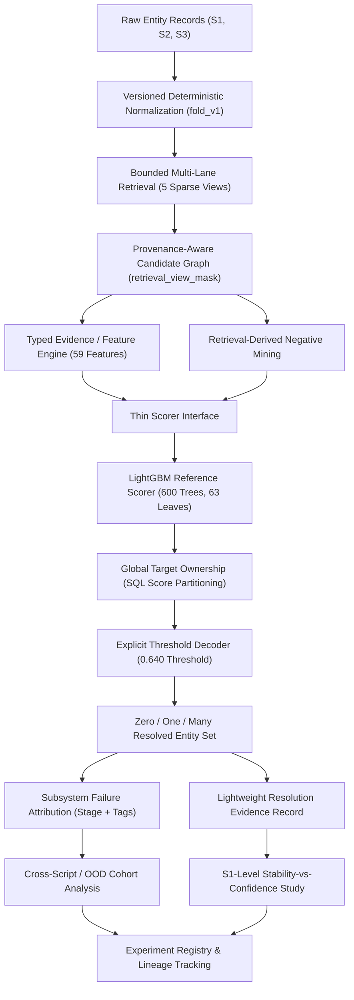

# Concord Architecture Freeze (Version 1.0)

**Document Type:** Project Architectural Specification & Freeze Baseline  
**Authority:** Architectural Freeze approved following the forensic audit of commit `1133bfd` (`amazon-ml-2026-final`).  
**Status:** **ACTIVE / FROZEN FOR IMPLEMENTATION.**  
**Applies To:** All new engineering, module development, experiments, and documentation in `concord-entity-resolution`.

---

## 1. System Thesis

Concord is an evidence-centric entity-resolution system designed to resolve millions of noisy query records against large-scale target collections without all-pairs Cartesian comparison. 

The core thesis of Concord is:
> **An entity-resolution system must not merely emit match IDs—it must be structurally accountable.** When an entity decision is wrong or a match is missed, the system must deterministically attribute the root cause to the responsible pipeline stage (Retrieval, Ranking, Ownership, or Decoding), rather than treating the model as an opaque black box. Furthermore, resolution stability across retrieval lanes and competitive margins should provide actionable insight into decision reliability.

---

## 2. Approved Architectural Direction

The approved architecture is **Option B (Evidence-Centric Entity Resolution)** with a **Scoped Option-C Stability Extension**.



The system strictly decouples and evaluates four primary pipeline layers:
1. **Retrieval:** Evaluated by **Recall@K** (K=1, 5, 10, 20) and candidate density.
2. **Ranking:** Evaluated by pairwise **AUROC, LogLoss, and precision-recall**.
3. **Ownership:** Evaluated by **target exclusivity and rival margins**.
4. **Decoding:** Evaluated by macro **F0.5** over resolved entity sets.

---

## 3. The Six Frozen Decisions

### DECISION D1: Dual-Track Data Strategy
- **Private Track:** Real Amazon ML Challenge 2026 data may be used locally in private environments for historical verification and large-scale replication. It is **never committed, pushed, or redistributed**.
- **Public / Distributable Track:** The project must be fully demonstrable without private data. A clean, non-confidential synthetic fixture is committed (`examples/synthetic/`), and suitable public entity-resolution benchmarks will be integrated. Both tracks execute through the identical typed Concord API.

### DECISION D2: Cross-Platform Support
- All **NEW** Concord code implemented outside `legacy_amazon` must run natively on both **Windows and Linux**.
- New code must avoid multiprocessing `fork` assumptions, relying instead on clean multi-threaded execution (DuckDB, PyArrow, Scipy OpenMP) or cross-platform `spawn`.
- Historical `legacy_amazon` code remains untouched and preserved for Linux/WSL2 reference.

### DECISION D3: Lightweight Stability Scope
- Concord freezes a **lightweight resolution evidence record** rather than an unbounded "proof-carrying" machine.
- Initial stability variables: retrieval lane redundancy (`contributing_lane_count`), single-lane-removal survival, score margin above threshold, ownership rival margin, and top-candidate ambiguity ratio.
- Expensive combinatorial feature-removal counterfactuals are explicitly omitted unless empirical evidence proves they are necessary.

### DECISION D4: Compact CLI Surface
Concord targets a focused CLI with exactly six primary verbs:
1. `concord inspect` — Inspect datasets, schemas, and split fingerprints.
2. `concord retrieve` — Execute multi-lane retrieval and evaluate Recall@K.
3. `concord train` — Fit a scorer on candidate features with negative sampling.
4. `concord resolve` — Run end-to-end resolution (retrieval $\to$ features $\to$ scoring $\to$ ownership $\to$ decoding).
5. `concord evaluate` — Compute macro F0.5, cohort breakdowns, and failure attribution.
6. `concord benchmark` — Measure throughput, peak memory, and latency.

Sub-stages (normalization, feature generation, negative mining) are configured via pipeline parameters rather than bloated top-level commands.

### DECISION D5: Dual Tabular / Metadata Serialization
- **Bulk Tabular Artifacts (Parquet):** Entities, candidates, features, scores, and resolution decisions must be stored in strongly typed, compressed Parquet files.
- **Metadata & Evidence (JSON):** Configurations, experiment manifests, schema definitions, and evidence summaries must be serialized in canonical UTF-8 JSON with sorted keys.
- CSV/TSV is used only for external submission export and human-readable fixtures, never as an internal pipeline contract.

### DECISION D6: Thin Scorer Interface with LightGBM Reference
- The modeling layer exposes a minimal, model-agnostic interface: `fit(X, y)`, `predict_proba(X)`, `get_params()`, and `fingerprint()`.
- **LightGBM** is the first-class reference implementation, configured with the verified 600-tree historical hyperparameters.
- Concord will not construct AutoML systems, plugin marketplaces, or complex model-serving infrastructure.

---

## 4. Subsystem Failure Taxonomy

Error attribution must separate the **Primary Failure Stage** (mutually exclusive) from **Orthogonal Failure Tags** (multiple may apply):

```text
PRIMARY FAILURE STAGE (Mutually Exclusive):
├── RETRIEVAL                        (Candidate never entered graph in any lane)
├── RANKING                          (Retrieved, but model probability too low)
├── OWNERSHIP                        (Scored above threshold, but lost to competing S1 query)
├── DECODING                         (Owned, but fell below the 0.640 decision threshold)
└── AMBIGUOUS_OR_INSUFFICIENT        (Data conflict, severe corruption, or identical names)

ORTHOGONAL TAGS (Apply as Appropriate):
├── CROSS_SCRIPT                     (Query and target use different Unicode scripts)
├── COUNTRY_OOD                      (Entity belongs to uncalibrated OOD country, e.g. France)
├── TRANSLITERATION_DEPENDENT        (Requires phonetic matching across scripts)
├── NORMALIZATION_SENSITIVE          (Mismatch in punctuation, spacing, or legal suffix)
├── SINGLE_LANE                      (Candidate supported by only 1 retrieval lane)
├── ZERO_MATCH                       (Query entity has no valid target links)
├── MULTI_MATCH                      (Query entity links to multiple targets)
└── HIGH_AMBIGUITY                   (Generic brand or high-density target collision)
```

*Example:* An India business name transliterated from Devanagari that fails TF-IDF retrieval is classified as:  
`primary_stage = RETRIEVAL`, `tags = [CROSS_SCRIPT, TRANSLITERATION_DEPENDENT]`.

---

## 5. Implementation Roadmap: The Four Gates

Implementation proceeds strictly through four sequential gates:

| Gate | Title | Core Deliverables | Exit Criteria |
|---|---|---|---|
| **C1** | **Foundation + Contracts** | Typed dataclasses (`EntityRecord`, `NormalizedEntity`), deterministic `normalize()`, dataset fingerprinting, Parquet/JSON IO, and `concord inspect`. | Full Windows/Linux test pass; normalization parity verified against historical `fold()`. |
| **C2** | **Retrieval + Provenance** | Bounded 5-view sparse retrieval, `retrieval_view_mask`, candidate distributions, Recall@1/5/10/20, and `concord retrieve`. | Bounded candidate graph generated; provenance preserved for 100% of pairs; Recall@K measured. |
| **C3** | **Evidence + Model + Decoder** | 59-feature extraction, thin scorer interface, LightGBM reference model, global ownership SQL, threshold decoder, failure attribution engine, and `concord resolve`. | 59-feature parity verified; zero target duplicate ownership; failure attribution operational. |
| **C4** | **Cross-Script + Stability + Release** | Cross-script / OOD cohort evaluation, S1-level stability-vs-confidence experiment, performance benchmarks, and public release. | Stability study complete (null or positive); benchmarks documented; public docs verified. |

---

## 6. Claim Policy & Integrity Rules

Every project claim must adhere to `docs/audit/CLAIM_BOUNDARY.md`:
1. **Scale Wording:** Always state: *"Resolved 1.73M source entities against a 9.97M-target universe using bounded multi-view retrieval that produced an 87.9M-pair candidate graph."* Never state or imply a Cartesian multiplication ($1.73\text{M} \times 9.97\text{M} = 87.9\text{M}$).
2. **Competition Metrics:** Leaderboard Macro F0.5 (0.955136) is preserved historical evidence, not a live portal verification.
3. **Cross-Script Gain:** The +0.00558 POLICY_DEV gain from transliteration features is preserved experiment-ledger evidence (#13), not newly reproduced.
4. **Unverified Claims:** Post-submission recollection of `~0.966`, `~2.9 GiB` RAM, and `32.05M / 16.76M` candidate runs are **UNVERIFIED** and must never be cited as verified facts.

---

## 7. Portfolio Boundary: Concord vs. Relay

Concord and Relay demonstrate completely orthogonal, non-overlapping engineering disciplines:

| Dimension | Relay Flagship | Concord Flagship |
|---|---|---|
| **Core Problem** | Authority under distributed failure | Identity under entity ambiguity |
| **Primary Domain** | Distributed systems, storage, consensus | Information retrieval, ML systems, entity resolution |
| **Correctness Invariant** | Linearizability, fencing, transaction validity | Resolution precision, ownership exclusivity, F0.5 |
| **Failure Modes** | Network partitions, worker crashes, race conditions | Retrieval misses, ranking errors, decoder thresholds |
| **Scale Demonstration** | Concurrent leases, retry storms, transactional fences | 1.73M queries, 9.97M targets, 87.9M candidate pairs |
| **Key Architectural Signal** | "Who is permitted to commit state?" | "Why should this identity link be trusted?" |

Concord will **never** incorporate distributed consensus, Raft, leases, or distributed task queues that duplicate Relay's narrative.

---

## 8. Explicit Non-Goals

The following technologies and approaches are **permanently out of scope** for Concord:
- **No LLM or GenAI matching** added for resume buzzwords.
- **No vector databases or deep embedding infrastructure** without measured cost-benefit justification against the sparse baseline.
- **No distributed computing engines (Spark, Ray, Kubernetes, Kafka)**; Concord is an efficient local/single-node pipeline.
- **No duplicate distributed-systems mechanisms** from Relay.
- **No AutoML or generic model plugin marketplaces.**
- **No event-sourced graph mutation engines or complex human-review UIs** in V1.
- **No redistribution of Amazon ML Challenge private data.**

---

## 9. Architecture Amendment Policy

This document is frozen. 

> **Amendment Policy:** Any implementation change that alters retrieval semantics, candidate-generation bounds, ownership rules, decoder logic, evidence classifications, or data redistribution boundaries **must be formally submitted as an explicit Architecture Amendment Document** rather than silently introduced in code.
