# Architecture Options Analysis: Future Concord Design

**Repository:** `concord-entity-resolution`  
**Purpose:** Evaluate three candidate architectural directions for Concord following the forensic audit of the historical competition baseline.

---

## 1. Architectural Candidates

```mermaid
flowchart TD
    subgraph OptionA["Option A: Clean Traditional ER Pipeline"]
        A1[Raw TSVs] --> A2[Basic Normalization]
        A2 --> A3[Bounded Retrieval]
        A3 --> A4[Pairwise Features]
        A4 --> A5[Classifier Model]
        A5 --> A6[Threshold Decoder]
        A6 --> A7[Resolved Matches TSV]
    end

    subgraph OptionB["Option B: Evidence-Centric Entity Resolution (APPROVED)"]
        B1[Raw Records] --> B2[Versioned Normalization]
        B2 --> B3[Multi-Lane Retrieval + Provenance Mask]
        B3 --> B4[Typed Feature Engine + Context]
        B4 --> B5[Thin Scorer Interface / LightGBM]
        B5 --> B6[Global Ownership + Explicit Decoder]
        B6 --> B7[Resolved Entity Sets]
        B6 --> B8[Deterministic Failure Attribution]
        B6 --> B9[Lightweight Resolution Evidence Record]
    end

    subgraph OptionC["Option C: Full Proof-Carrying / Self-Auditing Architecture"]
        C1[Raw Records] --> C2[Deterministic Normalization]
        C2 --> C3[Multi-Lane Retrieval]
        C3 --> C4[Combinatorial Feature Counterfactuals]
        C4 --> C5[Ensemble / Complex Scorer]
        C5 --> C6[Structural Set Decoder]
        C6 --> C7[Full Cryptographic Proof Object Per Record]
        C7 --> C8[Event-Sourced Reversible Version Tree]
    end
```

---

## 2. Option Descriptions

### Option A: Clean Traditional ER Pipeline
A direct refactoring and cleanup of the historical Amazon ML Challenge codebase into modular Python packages (`retrieval`, `features`, `modeling`, `inference`, `evaluation`).
- **Data Flow:** Normalization $\to$ Sparse Retrieval $\to$ 59 Features $\to$ LightGBM $\to$ Fixed Threshold $\to$ Final TSVs.
- **Philosophy:** Treat the system strictly as a clean, modular batch inference pipeline. Omit advanced diagnostic layers, failure attribution, or evidence tracking.

### Option B: Evidence-Centric Entity Resolution (Approved Direction)
Builds on the strengths of the verified historical baseline (five-view retrieval, candidate provenance masks, graph-context features, global ownership) while adding first-class engineering rigor and subsystem error attribution.
- **Data Flow:** Versioned Normalization $\to$ Multi-Lane Retrieval with Provenance $\to$ Typed Feature Engine $\to$ Retrieval-Derived Negatives $\to$ Thin Scorer Interface $\to$ Global Ownership + Explicit Decoder $\to$ Resolved Entity Sets $\to$ Subsystem Failure Attribution + Lightweight Resolution Evidence Records.
- **Philosophy:** Make every resolution decision accountable and debuggable. Distinguish cleanly between retrieval misses, ranking errors, ownership competition, and decoding failures. Includes a focused experimental module evaluating whether system-level stability predicts entity resolution errors better than model confidence alone.

### Option C: Full Proof-Carrying / Self-Auditing Architecture
An ambitious, research-heavy architecture treating entity resolution as a formal proof system.
- **Data Flow:** Normalization $\to$ Multi-Lane Retrieval $\to$ Combinatorial Feature Counterfactuals $\to$ Scorer $\to$ Full Proof Object Generation $\to$ Reversible Version Tree Merges/Splits.
- **Philosophy:** Every entity cluster is accompanied by a complete mathematical certificate containing all counterfactual ablations (e.g., removing any feature subset or retrieval lane), full event-sourced lineage, and an interactive audit UI.

---

## 3. Detailed Ten-Dimension Evaluation

| Dimension | Option A: Clean Traditional Pipeline | Option B: Evidence-Centric ER (Recommended) | Option C: Full Proof-Carrying Architecture |
|---|---|---|---|
| **1. Architectural Complexity** | **Low:** Straightforward refactor of existing scripts into importable modules. | **Moderate:** Adds typed data contracts, error attribution taxonomy, and lightweight evidence records. | **Very High:** Combinatorial counterfactual engines, event-sourcing, and massive proof data structures. |
| **2. Historical Evidence Compatibility** | **High:** Maps 1:1 with historical legacy code. | **High:** Directly exploits existing `retrieval_view_mask`, graph context, and ownership logic. | **Low:** Requires recomputing counterfactual feature permutations not preserved in historical data. |
| **3. Implementation Effort** | **2–3 Weeks:** Quick to build; mostly code organization and basic tests. | **4–5 Weeks:** 4 structured gates (Contracts $\to$ Retrieval $\to$ Evidence $\to$ Release). | **8–12+ Weeks:** High risk of stalling on complex proof structures and UI tooling. |
| **4. Reproducibility & Portability** | **Moderate:** Clean, but risks retaining opaque legacy assumptions. | **High:** Strict Windows/Linux parity, synthetic fixtures, deterministic fingerprints. | **Moderate-Low:** Enormous memory/compute requirements for combinatorial counterfactuals. |
| **5. ML Scientific Value** | **Low:** Simply reproduces a known gradient-boosted tree baseline. | **High:** Decouples retrieval recall from ranking and decoding; tests stability vs. confidence hypothesis. | **High (Theoretical):** Novel framing, but high risk of "explanation theatre" over practical utility. |
| **6. IR Engineering Value** | **Moderate:** Retains 5-view retrieval, but lacks granular Recall@K analysis. | **High:** Formalizes Recall@1/5/10/20, lane redundancy, and bounded sparse retrieval. | **Moderate:** IR depth obscured by heavy post-hoc proof generation. |
| **7. Interview Defensibility** | **Low-Moderate:** Easily dismissed as "cleaned-up Kaggle/hackathon code." | **Exceptional:** Answers "Why did this fail? Was it retrieval, ranking, ownership, or decoding?" | **Mixed:** Impressive buzzwords, but vulnerable to red-teaming on overengineering and latency. |
| **8. Novelty & Execution Risk** | **Low Risk / Zero Novelty:** Standard industry pipeline. | **Low-Moderate Risk / High Value:** Practical, defensible, production-grade systems thinking. | **High Risk:** Scope creep, excessive runtime overhead, premature abstraction. |
| **9. Computational Overhead** | **Zero Overhead:** Standard batch inference. | **Negligible Overhead:** Lightweight bitmask inspections and margin subtractions ($<3\%$ extra compute). | **Severe Overhead:** Re-evaluating 59 features across multiple ablations increases compute by $10\times$–$50\times$. |
| **10. Practical Maintenance** | **High:** Easy to maintain, but difficult to debug when quality drops. | **High:** Excellent debuggability via automated error attribution tags. | **Very Poor:** Complex schemas, fragile event trees, massive storage footprint per record. |

---

## 4. Why Option B Wins and Why Full Option C Is Rejected

### 4.1 The Rejection of Option A
Option A fails the flagship portfolio objective. Cleaning up competition code into nice Python packages demonstrates basic software engineering, but it does not showcase senior-level systems thinking, experimental methodology, or deep understanding of information retrieval failure modes. It leaves Concord vulnerable to the critique: *"This is just a Kaggle solution with unit tests."*

### 4.2 The Rejection of Full Option C
Full Option C represents classic architectural overengineering:
1. **Explanation Theatre:** Generating an enormous, multi-kilobyte JSON "certificate" for every resolved record adds massive storage overhead without providing proportional debugging signal.
2. **Computational Explosion:** Computing true feature-level counterfactuals ("What would the model have decided if feature $X$ were omitted?") requires either re-evaluating the tree model repeatedly or computing complex Shapley approximations across millions of candidates.
3. **Premature Productization:** Building reversible merge/split event trees and human-review dashboards is product engineering, not backend ML/IR systems architecture.

### 4.3 Why Option B is the Optimal Flagship
Option B captures the genuine intellectual core of Option C without the bloat:
- It uses the surviving **`retrieval_view_mask`** to make retrieval provenance a first-class citizen.
- It introduces a **deterministic error attribution taxonomy** that classifies failures by pipeline stage (Retrieval, Ranking, Ownership, Decoding) rather than guessing.
- It includes a **scoped, testable stability experiment** (Gate C4) that tests whether resolution fragility predicts errors better than model confidence, without needing full combinatorial ablations.
- It delivers an interview-defensible answer to the central question:
  > *"How do we resolve millions of records against a massive universe without all-pairs comparison, and how do we know whether an error came from retrieval, ranking, decoding, or data ambiguity?"*
