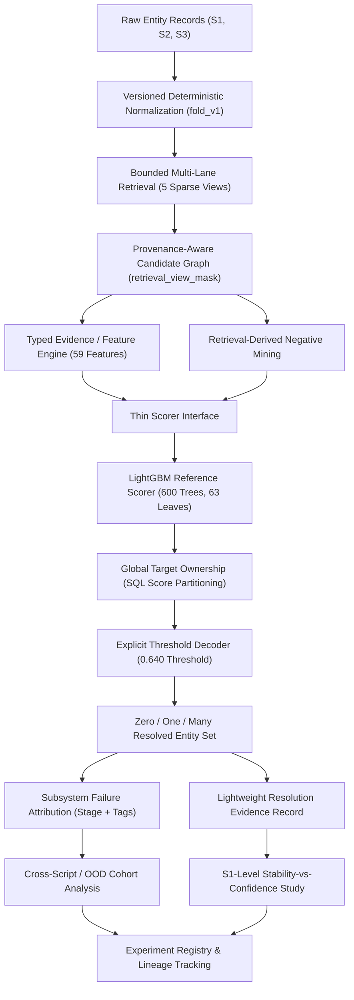

# Architecture Recommendation: Evidence-Centric Concord

**Repository:** `concord-entity-resolution`  
**Recommendation:** **Option B (Evidence-Centric Entity Resolution)** with a **Scoped Option-C Stability Extension**.  
**Architectural Status:** FROZEN FOR IMPLEMENTATION.

---

## 1. System Vision & Architecture Diagram

Concord is an evidence-centric, multilingual entity-resolution system designed to resolve millions of noisy query records against large-scale target indexes without all-pairs Cartesian comparison. 

The core thesis of Concord is that **resolution decisions must be debuggable, attributable, and reproducible**. When a wrong entity is linked or a correct match is missed, the system must deterministically attribute the root cause to the responsible pipeline stage (Retrieval, Ranking, Ownership, or Decoding), rather than treating the model as an opaque black box.



---

## 2. Decoupled Pipeline Subsystems

The architecture strictly decouples four distinct operational phases that were historically conflated into a single monolithic competition script:

### Subsystem 1: Multi-Lane Bounded Retrieval
- **Responsibility:** Massive candidate-space reduction ($O(N \times M) \to O(N \times K)$).
- **Contract:** Accepts normalized query and target records; fits bounded sparse TF-IDF vectorizers; executes bounded matrix products (`sparse_dot_topn`); outputs candidate pairs annotated with a bitmask `retrieval_view_mask`.
- **Metrics:** Evaluated strictly via **Recall@K (K=1, 5, 10, 20)** and candidate density distributions. Downstream F0.5 is explicitly excluded from retrieval evaluation.

### Subsystem 2: Pairwise Evidence & Scoring (Ranking)
- **Responsibility:** Compute structured, verifiable pair features and predict pair match probabilities.
- **Contract:** Accepts candidates and raw/normalized records; generates a 59-feature float32 vector adhering to `ordered_59_feature_schema.json`; scores pairs using a thin model-agnostic interface (`fit`, `predict_proba`, `fingerprint`).
- **Reference Model:** `LightGBMClassifier` (600 trees, lr=0.05, 63 leaves, L2=1.0).
- **Metrics:** Evaluated via **AUROC, LogLoss, and pair ranking precision** prior to global ownership or thresholding.

### Subsystem 3: Global Target Ownership Arbitration
- **Responsibility:** Arbitrate global competition when multiple S1 queries claim the same S2/S3 target.
- **Contract:** Enforces the one-to-one or many-to-one target exclusivity constraint. Implemented via deterministic DuckDB SQL:
  ```sql
  ROW_NUMBER() OVER(PARTITION BY target_id ORDER BY score DESC, s1_id ASC)
  ```
- **Diagnostics:** Emits rival margins (`score - runner_up_score`) and target contention counts.

### Subsystem 4: Set Decoding & Zero/One/Many Emission
- **Responsibility:** Convert continuous candidate probabilities and ownership status into final discrete entity sets.
- **Contract:** Applies calibrated decision policy ($\ge 0.640$ threshold); supports zero matches (empty S1 row), single matches, and valid multiple matches.
- **Metrics:** Evaluated via **Macro F0.5** per source entity.

---

## 3. What Does NOT Need to be Rebuilt (Accepted Historical Starting Points)

Concord explicitly reuses and honors verified mechanisms from the historical baseline:
1. **The Five-View Retrieval Concept:** Character trigrams, compact trigrams, address unigrams, combined, and reverse transposed retrieval are proven to provide high candidate recall.
2. **Candidate Provenance via Bitmask:** Storing lane membership in `retrieval_view_mask` is computationally free and analytically powerful.
3. **The 59-Feature Definitions:** The 55 direct/cosine/context features plus 4 cross-script features are frozen, typed, and mathematically sound.
4. **Global Target Ownership via SQL:** Window-partitioned ownership is deterministic, fast, and eliminates iterative matching loops.
5. **Fixed 0.640 Threshold Baseline:** Serves as the primary reference policy against which any new decoder must compete.
6. **Cryptographic Manifest Infrastructure:** Preserving SHA-256 hashes for all inputs, outputs, models, and schemas is standard operating procedure.

---

## 4. What New Concord Must Add

New Concord development focuses entirely on institutionalizing engineering rigor and diagnostic transparency:
1. **Cross-Platform Execution:** Clean, typed Python modules supporting native Windows and Linux without `fork` dependencies.
2. **Dual-Track Data Operation:** The entire pipeline executes out of the box on committed synthetic fixtures (`examples/synthetic/`) without requiring private challenge data.
3. **Deterministic Failure Attribution:** Automated tagging of errors into primary stages (**RETRIEVAL, RANKING, OWNERSHIP, DECODING, AMBIGUOUS**) and orthogonal characteristics (**CROSS_SCRIPT, COUNTRY_OOD, SINGLE_LANE**, etc.).
4. **Lightweight Resolution Evidence Records:** Clean per-resolution diagnostic records tracking scores, rival margins, and lane survival.
5. **S1-Level Stability Experiment:** Rigorous experimental verification testing whether system resolution stability predicts entity errors better than raw model confidence.
6. **Compact CLI Surface:** A clean, 6-command interface (`inspect`, `retrieve`, `train`, `evaluate`, `resolve`, `benchmark`).

---

## 5. Architectural Boundary: Legacy vs. New Concord

```text
concord-entity-resolution/
├── src/concord/legacy_amazon/      <-- PRESERVED HISTORICAL REFERENCE (Frozen Baseline)
│   ├── frozen_*.py                 <-- Immutable competition source code
│   └── artifacts/*.json            <-- Immutable historical schemas/configs
│
└── src/concord/                    <-- NEW CONCORD ARCHITECTURE (Active Development)
    ├── retrieval/                  <-- Bounded multi-lane retrieval & Recall@K
    ├── features/                   <-- Typed feature engine & parity validation
    ├── modeling/                   <-- Thin scorer interface & LightGBM reference
    ├── inference/                  <-- Ownership & explicit set decoders
    ├── evaluation/                 <-- Failure attribution & stability experiment
    └── utils/                      <-- Cross-platform IO, Parquet, hashing
```

**Rule:** `legacy_amazon` is the historical control and truth oracle. New Concord modules are written cleanly from scratch outside `legacy_amazon`, importing legacy utilities only for regression parity testing.
