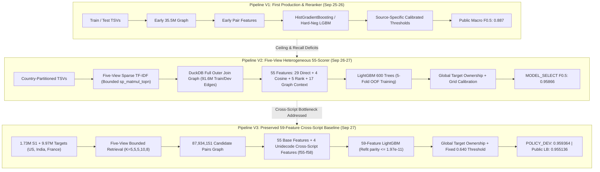

# Historical Pipeline Lineage: Concord Baseline Evolution

**Repository:** `concord-entity-resolution`  
**Preserved Baseline Commit:** `1133bfda496e2be59623fe154ec3dac45c13361f`  
**Preserved Baseline Tag:** `amazon-ml-2026-final`

---

## 1. Architectural Lineage Overview

The historical development of Concord (Team Aurorawave) did not proceed as a single static pipeline. The preserved evidence and experiment ledger document **three distinct, non-overlapping production pipeline architectures** (V1, V2, and V3). 

Each pipeline generation tackled specific failure modes identified in its predecessor:
- **V1:** Proved large-scale end-to-end viability using initial sparse blocking, HistGradientBoosting / hard-negative reranking, and calibrated thresholds.
- **V2:** Introduced the five-view heterogeneous sparse retrieval architecture, bounded sparse matrix products, and 55 direct, numeric, rank, and DuckDB graph-context features.
- **V3:** Expanded V2 with 4 deterministic Unidecode cross-script features, a 59-feature LightGBM model, global target ownership, and a fixed 0.64 threshold. This constitutes the preserved `amazon-ml-2026-final` submission baseline.

---

## 2. Pipeline V1: Original Production & Hard-Negative Prototype

- **Chronology:** September 25 to 26, 2026.
- **Purpose:** First end-to-end pipeline capable of processing large-scale competition TSVs, producing formatted submission files, and validating schema compliance under deadline constraints.
- **Input Dataset:** Organizer `train_source1.tsv`, `train_source2.tsv`, `train_source3.tsv`, `train_ground_truth.tsv`, and test files.
- **Target Corpus:** S2 and S3 collections.
- **Normalization:** Initial case-folding and basic Unicode stripping.
- **Candidate-Generation Strategy:** Early sparse TF-IDF inverted index blocking.
- **Retrieval Lanes:** Baseline lexical matching without separate compact or reverse lanes.
- **Candidate Volume:** 35,456,200 candidate pairs.
- **Feature Generation:** Pairwise string similarities, token overlap ratios.
- **Negative-Sampling Strategy:** Standard random / lexical negative sampling, supplemented in Experiment #2 with targeted hard negatives mining from top-K errors.
- **Model:** `HistGradientBoostingClassifier` baseline; superseded by early LightGBM hard-negative reranker.
- **Decoder / Decision Policy:** Calibrated source-specific thresholds ($S_2 \ne S_3$), followed by global target uniqueness.
- **Recorded Results:**
  - V1 Baseline Public Leaderboard: **Macro F0.5 = 0.887** (Output hash `a6f83e7cd4f2...`).
  - V1 Hard-Negative Calibration: **Macro F0.5 = 0.921034** (Model hash `643e5a34...`).
- **Disposition:** **REJECTED as final baseline; preserved as lineage foundation.** Proved end-to-end execution, but retrieval recall ceilings and cross-script degradation left major quality headroom.
- **Code Location:** `build_v1_submission.py`, `calibrate_v1_submission.py`, `experiments/generation_01/v1_submission_01/` *(Archived in private external workspace, documented in `archive_manifest/experiment_artifacts.json`)*.
- **Reproducibility Status:** Not runnable from Git alone; depends on external V1 generation archives and private raw inputs.

---

## 3. Pipeline V2: Five-View Sparse Retrieval & 55-Feature Qualification

- **Chronology:** September 26 to 27, 2026.
- **Purpose:** Break through the V1 retrieval recall ceiling by introducing heterogeneous sparse TF-IDF views, exact cosine recomputation, and competitive graph-context features.
- **Input Dataset:** Organizer training datasets partitioned by country (`US`, `India`).
- **Target Corpus:** S2 and S3 target records.
- **Normalization:** Standardized `fold()`: Unicode NFKD decomposition + combining-character removal + case folding.
- **Candidate-Generation Strategy:** Five heterogeneous TF-IDF vectorizers fit on 3M record samples, bounded by `sparse_dot_topn`:
  - `name`: char_wb trigrams (K=5)
  - `compact`: char trigrams with whitespace removed (K=5)
  - `address`: word unigrams (K=5)
  - `combined`: 50/50 weighted combination of name and address (K=10)
  - `reverse`: combined view transposed (targets query sources, K=8)
- **Candidate Cap & Union:** Bounded per view; merged via DuckDB full outer join; emitted bitmask `retrieval_view_mask`.
- **Feature Generation (55 Features):**
  - 29 direct string, token, and numeric match features (RapidFuzz ratio, Jaro-Winkler, token set/sort, Jaccard, numeric coverage).
  - 4 exact cosine similarities (recomputed via sparse matrix dot products).
  - 5 retrieval rank features (sentinel 999 for absent views).
  - 17 DuckDB windowed graph-context features (`query_source_rank`, `query_source_delta_best`, `target_owner_rank`, `target_delta_best`, `target_rival_margin`).
- **Negative-Sampling Strategy:** Implicit hard negatives formed by all non-truth candidate pairs generated by the five retrieval views over `MODEL_TRAIN`.
- **Model:** `LGBMClassifier` (600 estimators, lr=0.05, 63 leaves, min child samples 100, L2=1.0, seed=42). 5-fold out-of-fold scoring on `MODEL_TRAIN` using blake2b hash fold partitioning.
- **Decoder / Decision Policy:** Grid-search calibration over thresholds $[0.0, 1.0]$ in steps of 0.005 on `THRESHOLD_CALIBRATION`. Evaluated on `MODEL_SELECT` (15,113 S1 records, 52,358 truth links).
- **Recorded Results:**
  - Medium qualification sample oracle: **0.999623**; truth recall: **0.999136** (5,000 S1 records; 121 truths uniquely recovered by reverse view).
  - MODEL_SELECT: **Macro F0.5 = 0.958663** (below the branch's pre-declared 0.98 authorization gate).
- **Disposition:** **PROMOTED as candidate graph builder and base feature architecture**, but the standalone 55-feature classifier was superseded by V3.
- **Code Location:** `src/concord/legacy_amazon/frozen_full_graph_builder.py`, `src/concord/legacy_amazon/frozen_stage1_55_scorer.py`.
- **Reproducibility Status:** Runnable only with private organizer data on high-memory Linux (requires multiprocessing `fork`).

---

## 4. Pipeline V3: Preserved 59-Feature Cross-Script Baseline

- **Chronology:** September 27, 2026.
- **Purpose:** Production test execution and official submission. Addressed V2 cross-script failure modes using deterministic Unidecode transliteration features, scored the entire test graph, and produced final submission files.
- **Input Dataset:**
  - Training: 3,376,945 labeled candidate rows.
  - Test: 1,732,544 S1 query entities and 9,969,589 target IDs across US, India, and France.
- **Target Corpus:** Complete S2 and S3 target universe.
- **Normalization:** Identical `fold()` NFKD + case-folding function.
- **Candidate-Generation Strategy:** Identical 5-view bounded retrieval with `sparse_dot_topn`. Produced an **87,934,151-pair test candidate graph**.
- **Feature Generation (59 Features):**
  - 55 base features from V2.
  - 4 cross-script features from `qualified_crossscript_generator.py`:
    - `f55`: transliterated-name char-trigram Jaccard (Unidecode + lower).
    - `f56`: maximum RapidFuzz ratio across original/transliterated variations (OO, OT, TO, TT).
    - `f57`: dominant-script mismatch indicator (via Unicode name character inspection).
    - `f58`: transliterated-address token Jaccard.
- **Model:** Deterministic refit of the 59-feature `LGBMClassifier` (600 trees, seed 42). Verified max probability delta against historical checkpoint $\le 1.965 \times 10^{-11}$.
- **Decoder / Decision Policy:**
  - Global Target Ownership: Each target assigned to highest-scoring S1 (`ORDER BY score DESC, s1_id ASC`).
  - Thresholding: S2 and S3 pairs accepted at $\ge 0.640$.
  - Output Formatting: Emitted 5,708,382 accepted links and 100,939 empty S1 rows.
- **Recorded Results:**
  - POLICY_DEV: **Macro F0.5 = 0.9593640004712406** (TP: 9,826, FP: 162, FN: 757). Gain of $+0.005573$ over 55-feature control.
  - Public Leaderboard: **Macro F0.5 = 0.955136**.
- **Output Artifacts:**
  - `matching_results.tsv` (SHA-256: `0153c2ad...`, 96,006,728 bytes)
  - `candidate_pairs.tsv` (SHA-256: `70916432...`, 1,155,697,650 bytes)
  - `Aurorawave_submission.zip` (SHA-256: `d0574aab...`, 523,531,529 bytes)
- **Disposition:** **PROMOTED.** Authoritative baseline for `amazon-ml-2026-final`.
- **Code Location:** `src/concord/legacy_amazon/*.py` (7 files) and `artifacts/*.json` (2 files).
- **Reproducibility Status:** Fully reproducible from preserved artifacts when supplied with private challenge data and omitted model weights on Linux/WSL2.

---

## 5. Comparative Architectural Matrix

| Dimension | Pipeline V1 | Pipeline V2 | Pipeline V3 (Preserved Baseline) |
|---|---|---|---|
| **Retrieval Architecture** | Basic sparse inverted index | 5-view bounded TF-IDF (`sparse_dot_topn`) | 5-view bounded TF-IDF (`sparse_dot_topn`) |
| **Candidate Volume** | 35,456,200 pairs | 91,621,656 pairs (Train/Dev) | 87,934,151 pairs (Test) |
| **Reverse Retrieval** | No | Yes (Transposed combined view, K=8) | Yes (Transposed combined view, K=8) |
| **Feature Dimensionality** | ~20 string features | 55 features (direct + cosine + rank + context) | 59 features (55 base + 4 cross-script) |
| **Cross-Script Handling** | None | Implicit NFKD normalization | Explicit Unidecode features (`f55`-`f58`) |
| **Classifier Model** | HistGradientBoosting / Early LGBM | LightGBM (600 trees, 63 leaves) | LightGBM (600 trees, 63 leaves, deterministic refit) |
| **Decision Decoder** | Source-specific calibrated thresholds | Grid-searched threshold + Global Ownership | Global Target Ownership + Fixed 0.640 Threshold |
| **Primary Metric** | 0.887 Public F0.5 | 0.95866 MODEL_SELECT F0.5 | 0.959364 POLICY_DEV / 0.955136 Public F0.5 |
| **Preservation Status** | Archived in external manifest | Code preserved in `legacy_amazon` | Fully pinned and verified baseline |
