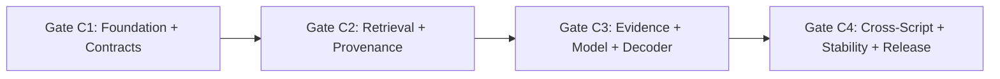

# Proposed Implementation Plan: Concord Four-Gate Architecture

**Repository:** `concord-entity-resolution`  
**Status:** SPECIFICATION FROZEN FOR IMPLEMENTATION.  
**Execution Rule:** Strictly gated sequential delivery. No gate may commence until all acceptance criteria of the preceding gate are satisfied and validated by tests.

---

## 1. Overview of Consolidated Gates

To ensure rapid, verifiable progress without premature optimization or unbounded scope, Concord's roadmap consolidates implementation into **four definitive gates**:

---

## 2. Gate C1: Foundation + Contracts

- **Primary Goal:** Establish typed, cross-platform core data models, deterministic normalization, dataset fingerprinting, and basic CLI inspection without touching production retrieval or scoring.
- **Scope:**
  - Define `EntityRecord` and `NormalizedEntity` dataclasses with strict null/empty handling.
  - Implement deterministic `normalize()` function with verified parity against historical `fold()`.
  - Implement normalization versioning (`nfkd-casefold-v1`).
  - Create dataset and split fingerprinting utilities (SHA-256 over canonical byte streams).
  - Build Parquet and JSON IO abstractions.
  - Implement the canonical experiment manifest validator.
  - Implement the initial compact CLI command: `concord inspect`.
  - Verify full native compatibility on both **Windows and Linux**.
  - Ensure all existing historical contract tests (`tests/test_*.py`) remain 100% green.
- **Non-Goals:**
  - No new retrieval engine.
  - No feature generation.
  - No model training or evaluation.
  - No modification of `src/concord/legacy_amazon/`.
- **Test Suite:**
  - Unit tests for `EntityRecord` and `NormalizedEntity` validation.
  - Parity test verifying `normalize(text) == fold(text)` across 1,000 Unicode test cases.
  - Round-trip serialization tests for Parquet and JSON formats.
  - Fingerprint invariance tests (verifying identical hashes across platforms).
  - CLI smoke tests for `concord inspect`.
- **Acceptance Criteria:**
  - Synthetic dataset (`examples/synthetic/`) passes end-to-end normalization and inspection.
  - Zero platform-specific failures on Windows or Linux.
  - Zero modifications to preserved `legacy_amazon` files.
- **Evidence Produced:** Gate C1 test report and canonical dataset fingerprint for `examples/synthetic/`.
- **Claim Unlocked:** *"Built typed, cross-platform entity resolution contracts with deterministic Unicode normalization."*
- **Stop Condition:** Complete test pass; human verification of CLI inspect output.

---

## 3. Gate C2: Retrieval + Provenance

- **Primary Goal:** Implement clean, bounded multi-lane retrieval with complete provenance tracking and formal Recall@K evaluation.
- **Scope:**
  - Implement clean `RetrievalEngine` supporting the 5 historical views (name, compact, address, combined, reverse).
  - Integrate `sparse_dot_topn` or equivalent bounded sparse matrix multiplication.
  - Annotate candidate pairs with bitmask `retrieval_view_mask` and per-lane ranks/cosines.
  - Compute candidate density distributions (mean, p50, p90, p99, max, zero-candidate rate).
  - Implement formal **Recall@K (K=1, 5, 10, 20)** evaluation decoupled from downstream F0.5.
  - Implement automated retrieval failure detection (identifying truth links dropped during blocking).
  - Add CLI command: `concord retrieve`.
- **Non-Goals:**
  - No 59-feature extraction yet.
  - No machine learning classifiers.
  - No global ownership arbitration.
  - No unconstrained all-pairs similarity search.
- **Test Suite:**
  - Unit tests for sparse vectorizer caching and deterministic sample fitting.
  - Bitmask integrity tests (verifying `retrieval_view_mask` matches contributing lanes).
  - Recall@K computation tests against known toy ground-truth.
  - Reverse-view transposition tests ensuring target queries properly map to S1 entities.
- **Acceptance Criteria:**
  - Synthetic and benchmark datasets produce bounded candidate graphs with zero unmapped candidates.
  - Provenance bitmask preserved for 100% of candidate pairs.
  - Measured Recall@1/5/10/20 reported in canonical experiment JSON.
- **Evidence Produced:** Canonical retrieval experiment manifest with candidate distribution percentiles and Recall@K curves.
- **Claim Unlocked:** *"Engineered bounded multi-view sparse retrieval with complete candidate provenance and measured Recall@K."*
- **Stop Condition:** Verification of retrieval recall ceilings and bitmask survival on test fixtures.

---

## 4. Gate C3: Evidence + Model + Decoder

- **Primary Goal:** Implement the typed 59-feature extraction engine, thin scorer interface, LightGBM reference scorer, deterministic global target ownership, and root-cause failure attribution.
- **Scope:**
  - Implement typed feature engine matching `ordered_59_feature_schema.json` (55 base + 4 cross-script).
  - Ensure feature extraction parity against historical `frozen_stage1_55_scorer.py` and `qualified_crossscript_generator.py`.
  - Implement retrieval-derived negative training data generator.
  - Define thin `Scorer` interface (`fit`, `predict_proba`, `fingerprint`).
  - Implement `LightGBMScorer` reference wrapper with hyperparameter validation.
  - Implement deterministic global target ownership arbitration via DuckDB SQL (`score DESC, s1_id ASC`).
  - Implement explicit threshold decoder ($\ge 0.640$) with zero/one/many match support.
  - Implement deterministic **Failure Attribution Engine** classifying errors into primary stages (**RETRIEVAL, RANKING, OWNERSHIP, DECODING, AMBIGUOUS**) and tags (**CROSS_SCRIPT, SINGLE_LANE**, etc.).
  - Add CLI commands: `concord train`, `concord resolve`, `concord evaluate`.
- **Non-Goals:**
  - No deep learning or neural cross-encoders.
  - No complex combinatorial counterfactuals.
  - No modification of the frozen 0.640 decision policy.
- **Test Suite:**
  - Feature extraction parity test comparing outputs against historical values.
  - DuckDB ownership tests verifying zero duplicate target assignments.
  - Threshold decoder unit tests for zero-match, single-match, and multi-match cases.
  - Attribution unit tests verifying synthetic errors map to correct stages.
- **Acceptance Criteria:**
  - Scorer produces identical rank orders and probabilities on reference fixtures.
  - Target uniqueness invariant ($|\text{owners}(t)| \le 1$) holds across 100% of targets.
  - Macro F0.5 evaluation matches historical calculation contracts.
- **Evidence Produced:** Gate C3 evaluation manifest with full confusion matrix, F0.5 scores, and root-cause failure breakdown.
- **Claim Unlocked:** *"Built an end-to-end evidence-centric entity-resolution pipeline with deterministic global ownership and root-cause error attribution."*
- **Stop Condition:** Verification of end-to-end resolution on evaluation datasets with failure taxonomy output.

---

## 5. Gate C4: Cross-Script + Stability + Scale + Release

- **Primary Goal:** Execute the S1-level stability-vs-confidence experiment, formalize cross-script and OOD cohort evaluation, measure operational benchmarks, and finalize the complete release.
- **Scope:**
  - Define explicit evaluation cohorts: `SAME_SCRIPT` vs. `CROSS_SCRIPT` and country-level splits.
  - Implement the **S1-Level Stability vs. Confidence Protocol** (AUROC, AUPRC, risk-coverage curves).
  - Implement `ResolutionEvidenceRecord` emission.
  - Benchmark operational performance: throughput (pairs/sec), peak RSS memory, disk IO.
  - Finalize CLI commands: `concord benchmark` and full CLI documentation.
  - Assemble public reproducibility release documentation and verify all claims against the Claim Boundary.
- **Non-Goals:**
  - No claim of novelty if the stability hypothesis produces a null result.
  - No promotion of unverified prompt metrics (~0.966, 2.9 GiB, 32.05M).
  - No distribution of private challenge data.
- **Test Suite:**
  - Stability metric calculation tests.
  - Risk-coverage curve monotonicity assertions.
  - CLI end-to-end pipeline integration test.
  - Documentation link and claim verification audit.
- **Acceptance Criteria:**
  - Stability study completed with pre-registered methodology; null or positive result fully documented.
  - Benchmarks reported with exact hardware specifications.
  - Full pipeline runs entirely on committed synthetic data without external downloads.
  - All public documentation aligns strictly with `CLAIM_BOUNDARY.md`.
- **Evidence Produced:** Final stability study report, benchmark manifest, and published release documentation.
- **Claim Unlocked:** *"Completed rigorous cross-script entity resolution evaluation and empirical resolution stability study."*
- **Stop Condition:** Complete project review and sign-off.
